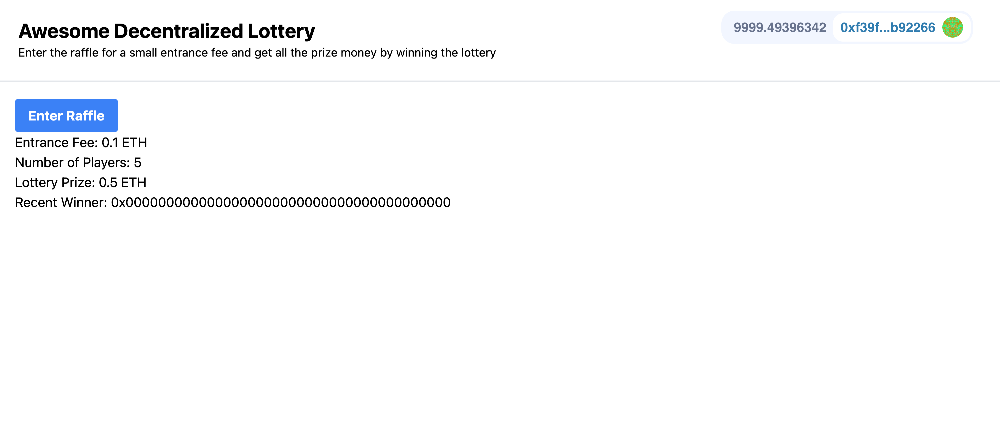

# Full Stack Web3 Development

## Basics of (Blockchain | Smart Contracts | Solidity | Remix | Hardhat | ChainLink | Moralis | Web3uikit | Ethers | Mocha | Chai | Waffle | React | NextJS | JavaScript | TailWind CSS)

This repo contains the practice projects that I did while learning smart contracts.

The things that I have learned have been given below.

- [Full Stack Web3 Development](#full-stack-web3-development)
  - [Basics of (Blockchain | Smart Contracts | Solidity | Remix | Hardhat | ChainLink | Moralis | Web3uikit | Ethers | Mocha | Chai | Waffle | React | NextJS | JavaScript | TailWind CSS)](#basics-of-blockchain--smart-contracts--solidity--remix--hardhat--chainlink--moralis--web3uikit--ethers--mocha--chai--waffle--react--nextjs--javascript--tailwind-css)
  - [1. Blockchain Basics](#1-blockchain-basics)
  - [2. Remix Simple Storage](#2-remix-simple-storage)
  - [3. Remix Storage Factory](#3-remix-storage-factory)
  - [4. Remix Fund Me](#4-remix-fund-me)
  - [5. Ethers.js Simple Storage](#5-ethersjs-simple-storage)
  - [6. Hardhat Simple Storage](#6-hardhat-simple-storage)
  - [7. Hardhat Fund Me](#7-hardhat-fund-me)
  - [8. HTML / Javascript Fund Me (Full Stack / Front End)](#8-html--javascript-fund-me-full-stack--front-end)
  - [9. Hardhat Smart Contract Lottery](#9-hardhat-smart-contract-lottery)
  - [10. NextJS Smart Contract Lottery (Full Stack / Front End)](#10-nextjs-smart-contract-lottery-full-stack--front-end)
  - [11. Hardhat Starter Kit](#11-hardhat-starter-kit)
  - [Demos](#demos)
    - [Awesome Decentralized Lottery App](#awesome-decentralized-lottery-app)
  - [Course Link](#course-link)

## 1. Blockchain Basics

- What is a Blockchain? What does a blockchain do?
- The Purpose Of Smart Contracts
- What have Smart Contracts done so far?
- Making My First Transaction
- Gas I: Introduction to Gas
- How Do Blockchains Work?
- Signing Transactions
- Gas II
- High-Level Blockchain Fundamentals

## 2. Remix Simple Storage

- Introduction
- Setting Up My First Contract
- Basic Solidity: Types
- Basic Solidity: Functions
- Basic Solidity: Arrays & Structs
- Basic Solidity: Compiler Errors and Warnings
- Memory, Storage, Calldata (Intro)
- Mappings
- Deploying My First Contract

## 3. Remix Storage Factory

- Introduction
- Basic Solidity: Importing Contracts into other Contracts
- Basic Solidity: Interacting with other Contracts
- Basic Solidity: Inheritance & Overrides

## 4. Remix Fund Me

- Introduction
- Sending ETH Through a Function & Reverts
- Chainlink & Oracles
- Review of Sending ETH and working with Chainlink
- Interfaces & Price Feeds
- Importing from GitHub & NPM
- Floating Point Math in Solidity
- Basic Solidity: Arrays & Structs II
- Review of Interfacs, Importing from GitHub, & Math in Solidity
- Libraries
- SafeMath, Overflow Checking, and the "unchecked" keywork
- Basic Solidity: For Loop
- Basic Solidity: Resetting an Array
- Sending ETH from a Contract
- Basic Solidity: Constructor
- Basic Solidity: Modifiers
- Testnet Demo
- Advanced Solidity
- Immutable & Constant
- Custom Errors
- Receive & Fallback Functions

## 5. Ethers.js Simple Storage

- Effective Debugging Strategies & Getting Help
- Tiny Javascript Refresher
- Asynchronous Programming in Javascript
- Compiling our Solidity
- Ganache & Networks
- Introduction to Ethers.js
- await Keyword
- Adding Transaction Overrides
- Transaction Receipts
- Sending a "raw" Transaction in Ethersjs
- Interacting with Contracts in Ethersjs
- Environment Variables
- Better Private Key Management
- Optional Prettier Formatting
- Deploying to a Testnet or a Mainnet
- Verifying on Block Explorers from the UI
- Alchemy Dashboard & The Mempool
- Typescript Ethers Simple Storage

## 6. Hardhat Simple Storage

- Introduction
- Hardhat Setup
- Deploying SimpleStorage from Hardhat
- Networks in Hardhat
- Programatic Verification
- Interacting with Contracts in Hardhat
- Custom Hardhat Tasks
- Hardhat Localhost Node
- The Hardhat Console
- Hardhat Tests
- Hardhat Gas Reporter
- Solidity Coverage
- Hardhat Waffle
- Typescript Hardhat Simple Storage

## 7. Hardhat Fund Me

- Introduction
- Hardhat Setup - Fund Me
- Linting
- Hardhat Deploy
- Mocking
- Utils Folder
- Testnet Demo - Hardhat Fund Me
- Solidity Style Guide
- Testing Fund Me
- Breakpoints & Debugging
- Gas III:
- console.log & Debugging
- Testing Fund Me II
- Storage in Solidity
- Gas Optimizations using Storage Knowledge
- Solidity Chainlink Style Guide
- Storage Review
- Staging Tests
- Running Scripts on a Local Node
- Adding Scripts to My package.json

## 8. HTML / Javascript Fund Me (Full Stack / Front End)

- Introduction
- How Websites work with Web3 Wallets
- HTML Setup
- Connecting HTML to Metamask
- Javascript in it's own file
- ES6 vs Nodejs
- Sending a transaction from a Website
- Resetting an Account in Metamask
- Listening for Events and Completed Transactions
- Input Forms
- Reading from the Blockchain
- Withdraw Function

## 9. Hardhat Smart Contract Lottery

- Introduction
- Hardhat Setup - Smart Contract Lottery
- Raffle.sol Setup
- Introduction to Events
- Events in Raffle.sol
- Chainlink VRF
- Implementing Chainlink VRF - Introduction
- Hardhat Shorthand
- Implementing Chainlink VRF - The Request
- Implementing Chainlink VRF - The FulFill
- Chainlink Keepers
- Implementing Chainlink Keepers - checkUpkeep
- Enums
- Implementing Chainlink Keepers - performUpkeep
- Deploying Raffle.sol
- Mock Chainlink VRF Coordinator
- Raffle.sol Unit Tests
- Testing Events & Chai Matchers
- Hardhat Methods & Time Travel
- Callstatic
- Raffle.sol Staging Tests
- Testing on a Testnet
- Typescript - Smart Contract Lottery

## 10. NextJS Smart Contract Lottery (Full Stack / Front End)

- Introduction
- Manual Header
- React Hooks
- useEffect Hook
- Local Storage
- isWeb3EnabledLoading
- web3uikit
- Introduction to Calling Functions in Nextjs
- Automatic Constant Value UI Updater
- runContractFunction
- useState
- Calling Functions in NextJS
- useNotification
- Reading & Displaying Contract Data
- Tailwind & Styling
- IPFS
- Hosting on IPFS & Filecoin using Fleek
- Filecoin Overview

## 11. Hardhat Starter Kit

- How to use hardhat starter kit

## Demos

### Awesome Decentralized Lottery App

- Used: Solidity, Hardhat, NextJS, Chainlink, Moralis, Web3uikit, TailWind CSS
- Connect to Wallet
- Enter the lottery using an entrance fee
- Chainlink VRF to generate a random winner in a truly decentralized way
- Chainlink Keepers to select the winner after every 30s
- Get all the money after winning the lottery
- Keeps track of the recent winner, number of players, total balance of the lottery

  

## Course Link

[freeCodeCamp Course](https://www.youtube.com/watch?v=gyMwXuJrbJQ&t=1s)
